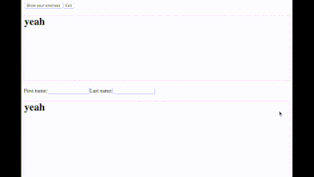

# react-kindness [](https://travis-ci.org/piglovesyou/react-kindness)

A lightweight, fully-customizable kind screen guide for React



[Demo](https://piglovesyou.github.io/react-kindness/)

To install

```js
$ npm install --save react-kindness
```

Put this somewhere in your component tree,

```js
import {KindnessPanel, Kindness} from 'react-kindness';
import 'react-kindness/dist/index.css';

// ...
    <KindnessPanel enabled={this.state.show}
                   onExit={() => this.setState({show: false})} />
```

then point out some elements that you want your guests to focus on

```js
<Kindness>
    <input type="text" {...} />
</Kindness>

<Kindness>
    <button type="submit">
        Submit
    </button>
</Kindness>
```

When the `<KindnessPanel>`'s `enabled` becomes `true`, the tutorial starts.

## Props of `<KindnessPanel>`

```js
type KindnessPanelProps = {|
  enabled: boolean,
  onExit: Function,
  spotType?: 'circle' | 'rect', // 'circle' by default
  initialIndex?: number,        // 0 by default
  children?: mixed,
  seriesId?: SeriesId,          // 'default' by default
|};
```


## Props of `<Kindness>`

```js
export type KindnessProps = {|
  children: mixed,
  title?: mixed,                // null by default
  message?: mixed,              // null by default
  order?: number | 'auto',      // 'auto' by default
  seriesId?: SeriesId,          // 'default' by default
|}
```

## Customizing a panel content

By default `<KindnessPanel />` uses `<KindnessPanelContent/>` internally. By passing a function as a child, you can customize the content.

```js
<KindnessPanel enabled={true}>
    {
        ({total, currentIndex, goNext, goPrevious, goIndex, finish}) => (
            <div>
                <h3>This is {stage} item</h3>
                <button onClick={goPrev}>Go previous</button>
                <button onClick={goNext}>Go next</button>
            </div>
        )
    }
</KindnessPanel>
```

## (wip) Get additional variables from `<Kindness />`

When you pass a function to `<Kindness />` as a child, you can use additional variables.

```js
<Kindness>
    { (focused) => <div style={focused && {fontWeight: 'bold'}}>yeah</div> }
</Kindness>
```

## Todo

- [x] When scrolling a spot is something wrong
- [x] How can I put all into a single root dom
- [x] Jump to a target with [animated-scroll-to](https://www.npmjs.com/package/animated-scroll-to)
- [x] Why my popper doesn't flip on viewport boundary
- [x] 0.3.0 Fancy API for customising
- [x] 0.4.0 More tests
- [x] Scroll X
- [ ] Accept a function as a child to `<Kindness />`

## License

MIT
